# 2D Graphics System

A hardware-accelerated 2D graphics system built for the **Atlas / DE0-Nano-SoC**. The project uses the ARM **Hard Processor System (HPS)** to run a simple C graphics API, while the **FPGA fabric** handles command decoding, triangle rasterization, sprite rendering, double buffering, and VGA output.

The goal of the project is to hide the low-level hardware details behind a small software interface. A user can draw graphics using simple C functions like `draw_triangle()`, `draw_sprite()`, `clear()`, and `present_frame()`.

---

## Demo Video

Watch the project demo here:

[2D Graphics System Demo Video]([https://your-demo-video-link-here](https://youtu.be/XFwkRuyKpXk))

---

## Demo Output

### Demo 1: Command Set Demonstration

This demo shows the main graphics commands, including triangles, sprites, transparent sprite rendering, and the 64-colour output grid.

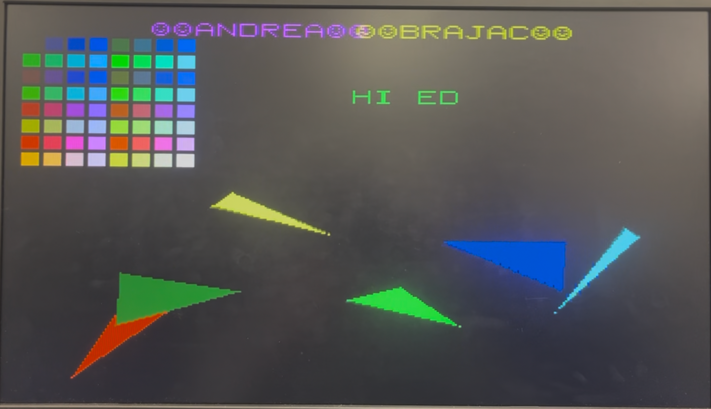

### Demo 2: Spinning Cube

This demo uses animated triangles to create a simple rotating cube effect.

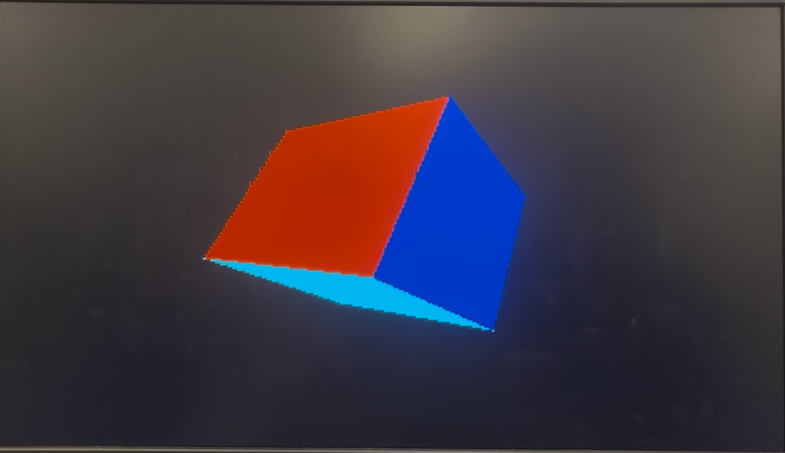

### Demo 3: Bouncing DVD Logo

This demo shows sprite rendering and simple animation.

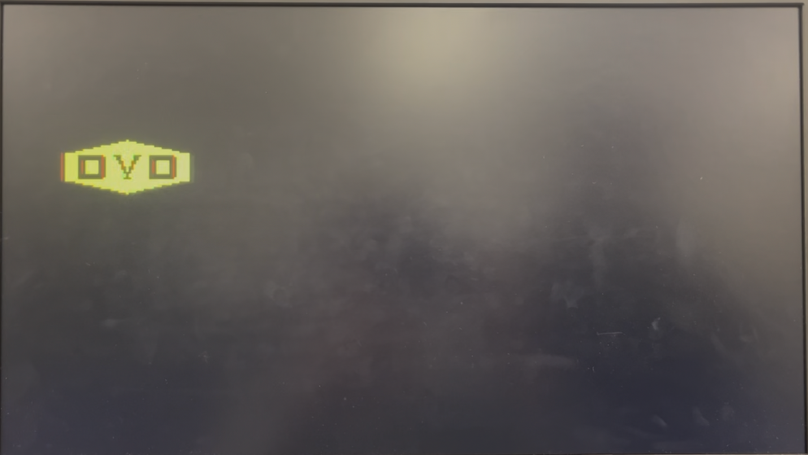

### Demo 4: Conway's Game of Life

This demo shows repeated frame updates and many small pixel/sprite-style changes across the screen.

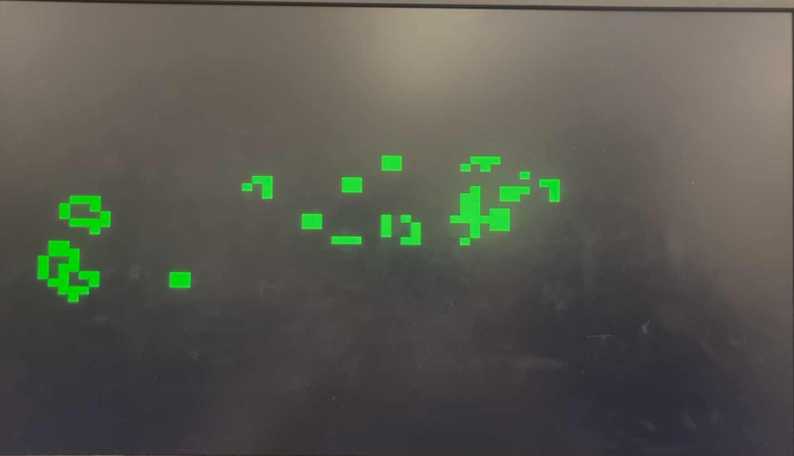

### Demo 5: Moving Triangles

This demo shows multiple triangles moving and rotating on the VGA display.

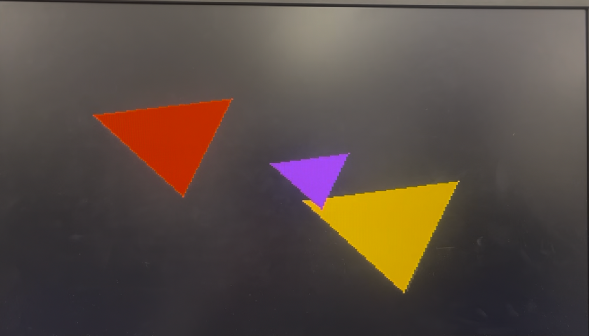

---

## Features

- Hardware rasterization of filled 2D triangles
- 8x8 monochrome sprite rendering
- Transparent sprite behaviour where unset sprite pixels do not overwrite the background
- Double-buffered frame buffer to reduce visible tearing
- VGA output using 640x480 timing
- 320x240 internal graphics resolution
- 64-colour output using 6-bit RGB colour data
- HPS-to-FPGA command interface using shared SDRAM and lightweight bridge registers
- FIFO-backed command interpreter for buffered command handling
- Simple C software library for drawing graphics from Linux on the HPS

---

## System Overview

The system is split into two major parts:

1. **Software on the HPS**
   - Runs C code under Linux.
   - Provides simple drawing functions.
   - Packs commands into binary command packets.
   - Writes command data into shared SDRAM.
   - Signals the FPGA through memory-mapped registers.

2. **Hardware on the FPGA**
   - Reads command packets from SDRAM.
   - Decodes command opcodes.
   - Rasterizes triangles and sprites.
   - Writes pixel data into the back buffer.
   - Sends the front buffer to the VGA output path.

### System Block Diagram

The full system block diagram shows how the HPS, command reader, command executer, FIFOs, rasterizer, frame buffer, and VGA controller connect.

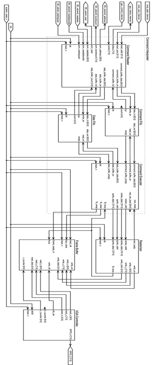

---

## Hardware and Software Stack

| Layer | Technology / Module | Purpose |
|---|---|---|
| User program | C | Calls simple graphics functions |
| Software library | `comm.c`, `comm.h` | Packs commands and communicates with FPGA |
| Processor system | HPS Linux | Runs the user program |
| Communication path | LWH2F bridge + shared SDRAM | Moves command data from HPS to FPGA |
| Command interpreter | `command_reader.sv`, `command_executer.sv`, `fifo.sv` | Reads, buffers, and decodes commands |
| Rasterizer | `rasterizer.sv` | Converts draw commands into pixel writes |
| Frame buffer | `frame_buffer.sv` | Stores front/back pixel buffers |
| Video output | `vga_timing.sv` | Generates VGA timing and display output |

---

## C Graphics API

The user-facing API is intentionally small.

```c
void init_comm();

void clear();

void present_frame();

void draw_triangle(
    int x1, int y1, int r1, int g1, int b1,
    int x2, int y2, int r2, int g2, int b2,
    int x3, int y3, int r3, int g3, int b3
);

void draw_sprite(
    int x,
    int y,
    int r,
    int g,
    int b,
    uint64_t *texture
);
```

### Minimal Example

```c
#include "comm.h"

int main(void) {
    init_comm();

    clear();

    draw_triangle(
        130, 100, 31, 63, 31,
        190, 100, 31, 63, 31,
        160, 150, 31, 63, 31
    );

    present_frame();

    return 0;
}
```

### Basic Animation Structure

```c
#include "comm.h"

int main(void) {
    init_comm();

    while (1) {
        clear();

        // Draw the next frame here
        draw_triangle(
            40, 40, 31, 0, 0,
            120, 40, 31, 0, 0,
            80, 120, 31, 0, 0
        );

        present_frame();
    }

    return 0;
}
```

---

## Command Interface

The HPS sends graphics commands to the FPGA using shared SDRAM and lightweight bridge registers.

### Command Flow

1. The HPS writes a command packet into SDRAM.
2. The HPS writes the command address and command size into FPGA-visible registers.
3. The HPS pulses the start register.
4. The FPGA command reader fetches the command from SDRAM.
5. The command opcode is stored in the command FIFO.
6. The command data is stored in the data FIFO.
7. The command executer decodes the command.
8. The rasterizer or frame buffer performs the requested operation.

### Command Flow Diagram

This diagram shows how a C function call becomes a hardware draw operation.


---

## Supported Commands

| Command | Opcode | Description |
|---|---:|---|
| `CLEAR` | `0x01` | Clears the back buffer to black |
| `PRESENT_FRAME` | `0x02` | Requests a front/back buffer swap |
| `DRAW_TRIANGLE` | `0x03` | Draws a filled triangle using three vertices |
| `DRAW_SPRITE` | `0x04` | Draws an 8x8 single-colour sprite |

---

## Coordinate and Colour Format

The internal graphics resolution is:

```text
320 x 240 pixels
```

The VGA controller uses standard 640x480 timing, so each internal pixel is displayed as a 2x2 block.

The frame buffer stores 6-bit colour data:

```text
{ red[1:0], green[1:0], blue[1:0] }
```

The software API accepts colour values using the packed vertex format:

```text
red:   0-31
green: 0-63
blue:  0-31
```

The current VGA output hardware reduces this to the available 6-bit RGB output.

---

## Command Interpreter

The command interpreter is responsible for getting commands from the HPS into the hardware graphics pipeline.

It is made of four main pieces:

- `command_reader.sv`
- `command_executer.sv`
- command FIFO
- data FIFO

### Command Reader Diagram

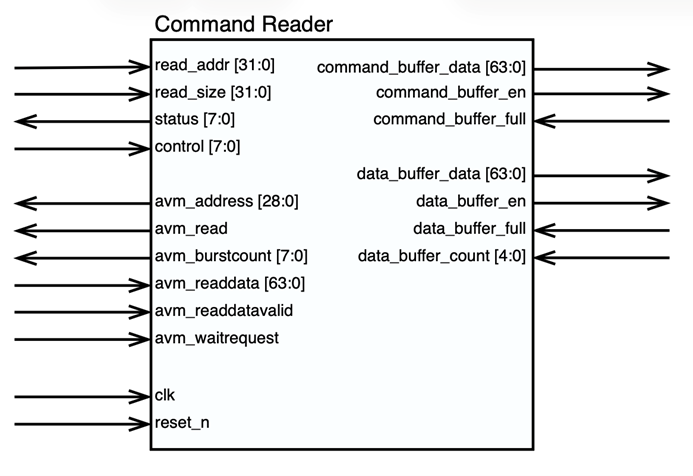

### Command Executer Diagram

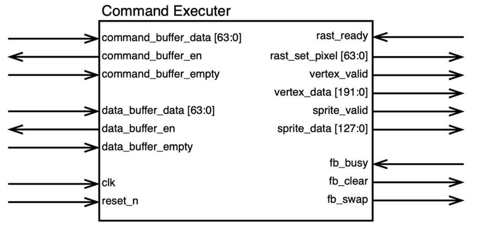

### FIFO Diagram

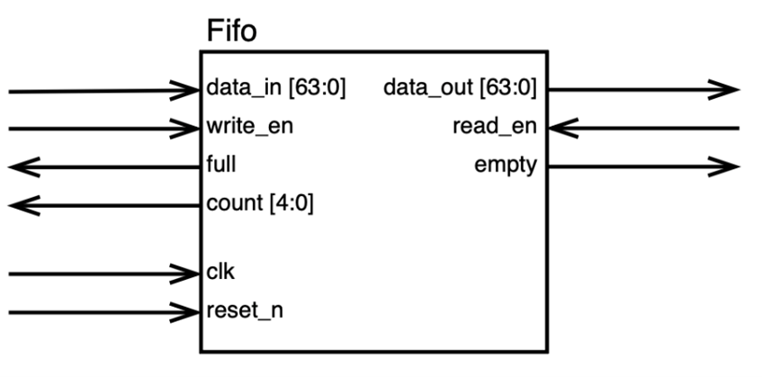

---

## Rasterizer

The rasterizer converts draw commands into pixel write requests for the frame buffer.

It supports two draw paths:

1. Filled triangles
2. 8x8 sprites

### Rasterizer Block Diagram

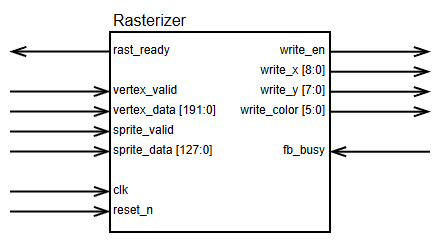

### Triangle Rasterization

Triangle drawing works by:

1. Loading three packed vertices.
2. Computing a bounding box around the triangle.
3. Computing edge equations for each triangle side.
4. Scanning pixels inside the bounding box.
5. Writing pixels that pass the inside-triangle test.

The rasterizer currently uses **flat shading**. The software function accepts separate colours for all three vertices, but the current hardware uses the first vertex colour for the entire triangle.

### Sprite Rendering

Sprites are represented as 8x8, 1-bit-per-pixel patterns stored in a 64-bit value.

- A `1` bit means the pixel is drawn.
- A `0` bit means no write occurs.

This naturally creates transparency because unset sprite pixels do not overwrite the existing background.

---

## Frame Buffer

The frame buffer stores the pixel data that is shown on the monitor. It uses a double-buffered design:

- The **front buffer** is read by the VGA output path.
- The **back buffer** is written by the rasterizer.

When `present_frame()` is called, the system requests a buffer swap. The swap is delayed until the VGA vertical blanking interval so that the visible frame does not change halfway through being drawn.

### Frame Buffer Block Diagram

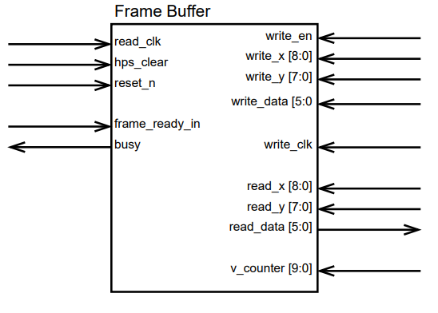

---

## VGA Output

The VGA controller generates the timing signals needed to display the frame buffer contents on a monitor.

The project uses 640x480 VGA timing at 60 Hz, while the internal graphics resolution is 320x240. Each internal pixel is scaled to a 2x2 block on the VGA display.

### VGA Timing Diagram

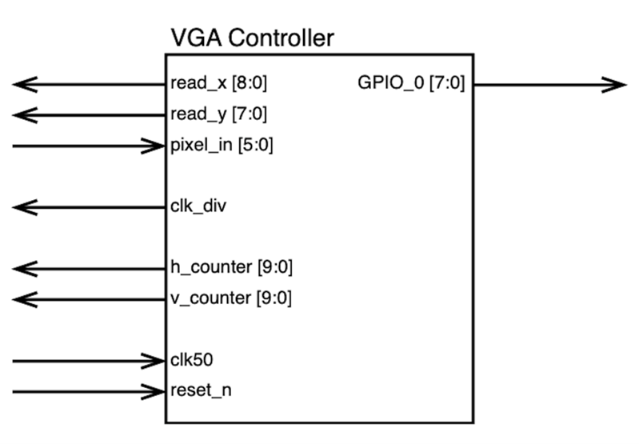

### VGA Wiring or Resistor Divider Diagram

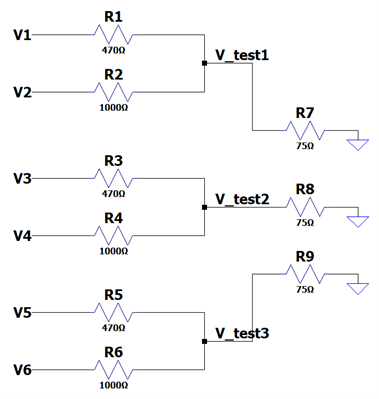

---

## Repository Layout

Suggested repository structure:

```text
.
├── README.md
├── hardware/
│   ├── graphics_system_top.sv
│   ├── command_reader.sv
│   ├── command_executer.sv
│   ├── fifo.sv
│   ├── rasterizer.sv
│   ├── frame_buffer.sv
│   ├── vga_timing.sv
│   └── graphics_system.tcl
│
├── software/
│   ├── comm.c
│   ├── comm.h
│   └── sprites.h
│
├── demos/
│   ├── main.c
│   ├── demos.c
│   ├── demos.h
│   ├── benchmarks.c
│   ├── benchmarks.h
│   ├── input.c
│   ├── input.h
│   ├── config.h
│   └── Makefile
│
└── images/
    ├── demo-1-command-set.png
    ├── demo-2-spinning-cube.png
    ├── demo-3-dvd-logo.png
    ├── demo-4-game-of-life.png
    ├── demo-5-moving-triangles.png
    ├── system-block-diagram.png
    ├── command-flow-diagram.png
    ├── command-reader-diagram.png
    ├── command-executer-diagram.png
    ├── fifo-diagram.png
    ├── rasterizer-diagram.png
    ├── frame-buffer-diagram.png
    ├── vga-timing-diagram.png
    └── vga-resistor-divider.png
```
---

## Building the Hardware

The hardware system was built using Intel / Altera FPGA tools for the Cyclone V SoC platform.

General hardware build flow:

1. Open the Quartus project.
2. Generate or update the Qsys / Platform Designer system using `graphics_system.tcl`.
3. Compile the Quartus project.
4. Convert the compiled FPGA bitstream to `.rbf` format.
5. Copy the generated `.rbf` file to the SD card as:

```text
graphics_system.rbf
```

The HPS boot script loads this file into the FPGA during boot.

---

## HPS Boot Setup

A Terasic Linux image was used for the HPS. The image required two major changes:

1. Replace the image preloader with the preloader generated for the custom hardware system.
2. Modify the boot script so that the FPGA is programmed during boot.

Example boot-script commands:

```bash
fatload mmc 0:1 $fpgadata graphics_system.rbf
fpga load 0 $fpgadata $filesize
run bridge_enable_handoff
run mmcload
run mmcboot
```

---

## Building the Demo Software

On the HPS Linux system, compile the demo software using the provided `Makefile`.

```bash
make
```

Run the executable:

```bash
sudo ./main
```

Root permissions may be required because the software library maps physical memory through `/dev/mem`.

---

## Known Limitations

- Triangle colour interpolation is not fully implemented.
- The current triangle rasterizer uses the first vertex colour for the whole triangle.
- Sprites are fixed at 8x8 pixels.
- Sprites are single-colour.
- The internal resolution is fixed at 320x240.
- VGA colour output is limited to 6-bit RGB.
- The command interface depends on fixed memory-mapped addresses, so the software and hardware address maps must match.

---

## Future Improvements

Possible improvements include:

- Barycentric colour interpolation for smooth triangle shading
- Z-buffering for depth-aware rendering
- Line, rectangle, and polygon draw commands
- Larger sprites
- Multi-colour sprites
- Higher internal resolution
- More efficient clear/fill operations
- More robust command packet formatting
- A larger graphics API built on top of the current low-level functions

---

## Authors

- Braden Vanderwoerd
- Jacob Edwards

Created for **ELEX 7660**.

---

## References

- Alice 4 FPGA Rasterizer by Brad Grantham and Lawrence Kesteloot
- Two-Dimensional Graphics Card (GPU) on an Altera FPGA by Peter Alexander Greczner
- VGA timing and connector reference material from VESA and VGA pinout documentation
